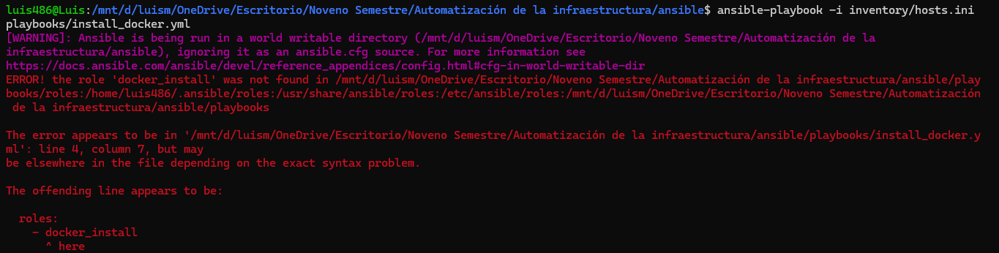
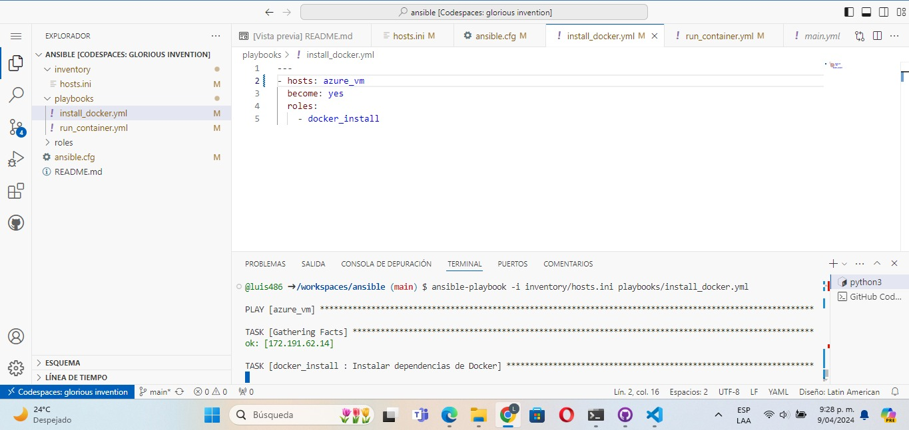
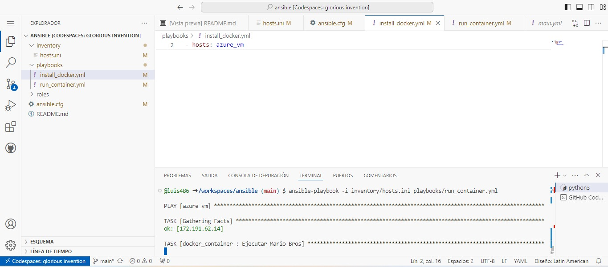
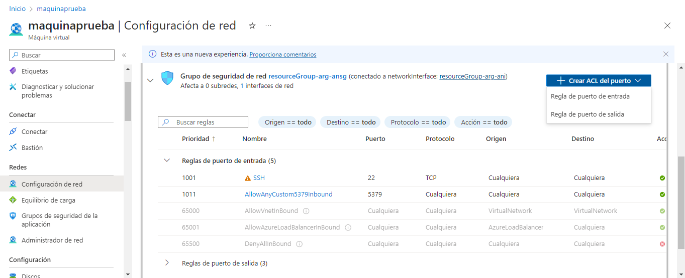
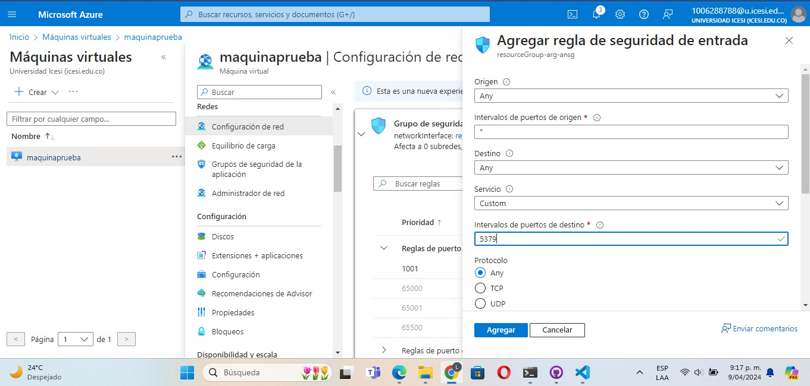
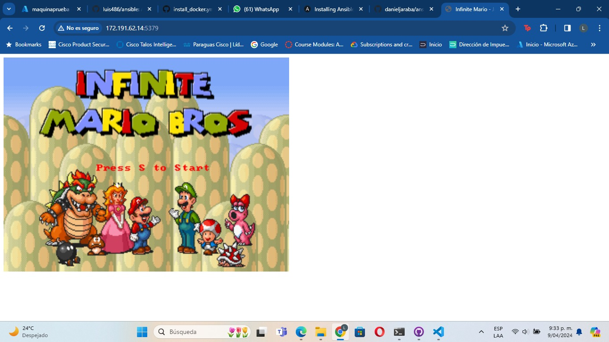

# Ansible

Este README describe los pasos para instalar Docker en un contenedor utilizando Ansible y luego ejecutar el contenedor que contiene el juego de Mario bros.

## Prerequisitos

1. Codespace (para evitar algunos errores que genera en local) como:
   

   - El cual se puede solucionar en codespace con el comando : *chmod 755 /workspaces/ansible/*

3. Ansible

4. Máquina virtual que se pueda conectar por SSH, sino tiene una, clone el siguiente repo:

   - https://github.com/Estebanm1812/Terraform-Modules.git

5. Repositorio con las configuraciones y buenas prácticas necesarias para ansible:

   - https://github.com/luis486/ansible.git

## Pasos para instalar docker

1. Ejecute el playbook `install_docker.yml` ubicado en la carpeta `playbooks` para instalar Docker en el sistema. Asegúrese de tener Ansible instalado y configurado correctamente antes de continuar.

   - ansible-playbook -i inventory/hosts.ini playbooks/install_docker.yml

   

2. Como segundo paso, es necesario ejecutar el contenedor, que también está ubicado en la carpeta `playbooks` 

   - ansible-playbook -i inventory/hosts.ini playbooks/run_container.yml

   

3. Como tercer paso es necesario configurar una regla que permita hacer un port forward para escoger el contenedor por donde va a correr el contenedor

Para hacer esta regla es necesario ir a las configuraciones de la VM subida en azure, apartado de configuración de red, crear ACL del puerto de entrada 
   
   
   
Un port forward indica que se reenvía el tráfico desde el puerto 5379 de la máquina host al puerto 8080 dentro del contenedor (el puerto puedes elegirlo tú mismo desde el             playbook/run_container)
   
   

4. Por último, coloca la dirección IP que te proporciona tu máquina virtual subida en azure (IP Pública) con el puerto que elegiste, y listo, disfruta!

   

## Notas Adicionales

    *Asegúrese de tener los roles y archivos necesarios configurados correctamente en su proyecto de Ansible para que los playbooks se ejecuten sin problemas.

    *Para detener y eliminar el contenedor de Mario, puede utilizar los comandos de Docker correspondientes, como docker stop y docker rm.

    *Si encuentra algún problema durante la instalación o ejecución, revise los logs de Ansible y Docker para obtener más detalles sobre los errores.

    *¡Disfruta jugando con Mario en tu contenedor!
